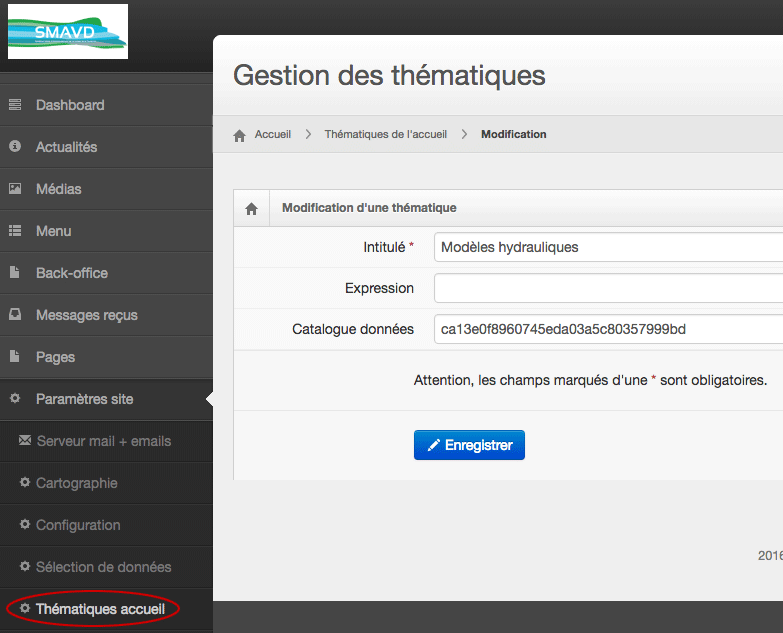
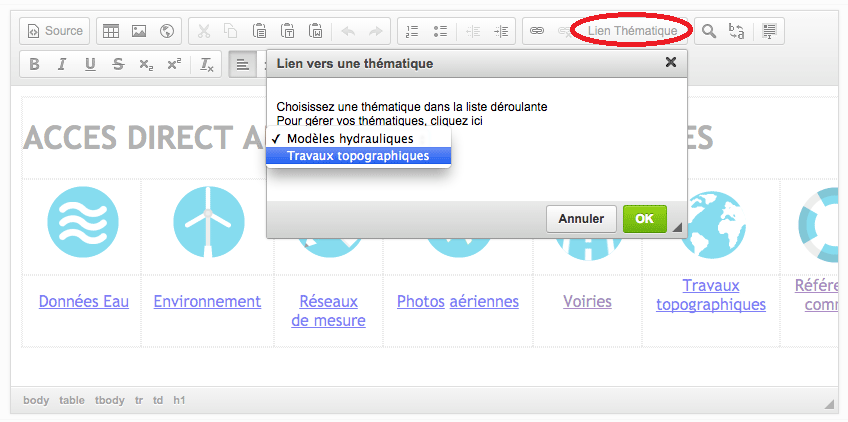

## 2.4\. Thématiques {#2-4-th-matiques}

L’administrateur peut définir des filtres personnalisés sur les données qu’il est possible de lier ensuite depuis les différents contenus. Attention aux confusions, ce qui est un thématique du portail est basée sur les catalogues Isogeo.

Pour gérer ces liens que nous appelons thématiques :

1.  Créer une thématique via le[menu dédié dans l&#039;admin](http://smavd.isogeo.net/admin/parametrage/recherche_thematiques_result.php?menu_item=edit_thematiques) avec :
    *   un intitulé
    *   une expression (terme pour le moteur de recherche Isogeo)
    *   l&#039;identifiant du catalogue (retrouvable dans APP :[https://app.isogeo.com/admin/catalogs](https://app.isogeo.com/admin/catalogs))

1.  La thématique est alors accessible via le menu de filtres dans la page des résultats
2.  Vous pouvez lier un contenu éditorial (actualité, zone html de la page d&#039;accueil, article...) via le widget &quot;Lien thématique&quot; de l&#039;éditeur WYSIWYG

