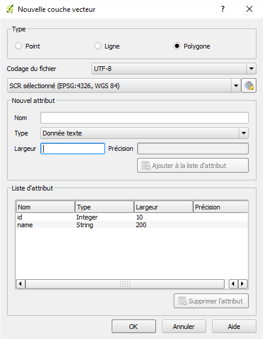
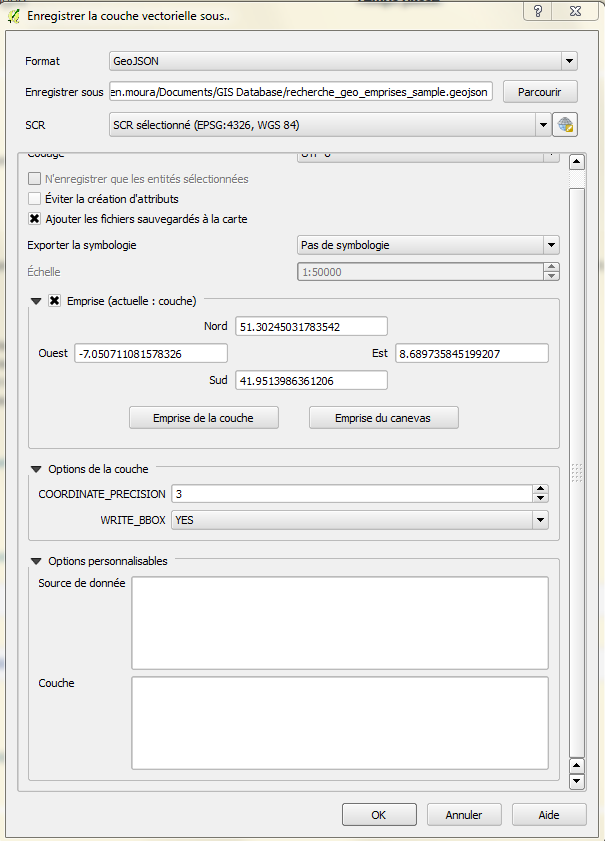

## 6.3\. Recherche par emprises {#6-3-recherche-par-emprises}

### 6.3.1\. Fonctionnement {#6-3-1-fonctionnement}

L’administrateur du portail peut établir une liste d&#039;emprises &quot;pertinentes&quot; au regard du patrimoine mis en valeur et des utilisateurs. Elles présentent l’avantage d’être des zones géographiques indépendantes des limites administratives (une zone de projet par exemple) ou adresse (remontée par le géocodeur).

Du côté de l’utilisateur, une liste déroulante apparaît à côté de la zone de saisie &quot;Localisation&quot; dans la zone de recherche.

### 6.3.2\. Activer/désactiver la fonctionnalité {#6-3-2-activer-d-sactiver-la-fonctionnalit}

1.  Se rendre dans la section &quot;Médias / Gestionnaire de fichiers&quot; ;
2.  Dans le répertoire &quot;files/recherche_geo&quot;, enregistrer le fichier des emprises (voir spécifications plus bas) ;
3.  Se rendre dans la section &quot;Paramètres site / Configuration&quot; ;
4.  Au paragraphe &quot;Fichier de recherche Géo&quot;, vérifier que les emprises sont correctement listées ;
5.  Activer/désactiver dans la liste déroulante.

Pour supprimer la recherche des emprises, il faut depuis le B.O. :

*   supprimer le fichier depuis la section &quot;Médias / Gestionnaire de fichiers&quot;
*   vérifier que cette suppression a bien été prise en compte en se rendant dans la section &quot;Paramètres site / Configuration&quot;. Cette dernière étape est impérative.

### 6.3.3\. Caractéristiques du fichier d’emprises {#6-3-3-caract-ristiques-du-fichier-d-emprises}

Pour permettre la recherche par emprise, un fichier doit être créé et déposé par l’admnistrateur. Il doit respecter certaines caractéristiques :

*   format GeoJSON ([http://geojson.org](http://geojson.org)) ;
*   le fichier doit se nommer “recherche_geo_emprises.geojson”
*   2 attributs obligatoires : id et name. Exemple :

&quot;properties&quot;: { &quot;id&quot;: 5, &quot;name&quot;: &quot;Bassin d&#039;Arcachon&quot; }

*   projection WGS84 (EPSG 4326). Exemple :

&quot;crs&quot;: { &quot;type&quot;: &quot;name&quot;, &quot;properties&quot;: { &quot;name&quot;: &quot;urn:ogc:def:crs:OGC:1.3:CRS84&quot; } },

*   précision des coordonnées =&lt; 3 ;
*   encodage UTF-8 ;
*   géométries de type polygone ;
*   les polygones doivent être dessinés dans le sens anti-horaire (sens inverse des aiguilles d&#039;une montre), selon la règle dite _Left-Hand-Rule<a href="#479675724263546-footnote-0">[1]</a>_.
*   l’emprise spatiale (bbox) doit être incluse par objet (voir[http://geojson.org/geojson-spec.html#bounding-boxes](http://geojson.org/geojson-spec.html#bounding-boxes))

[^1]: Ressources :